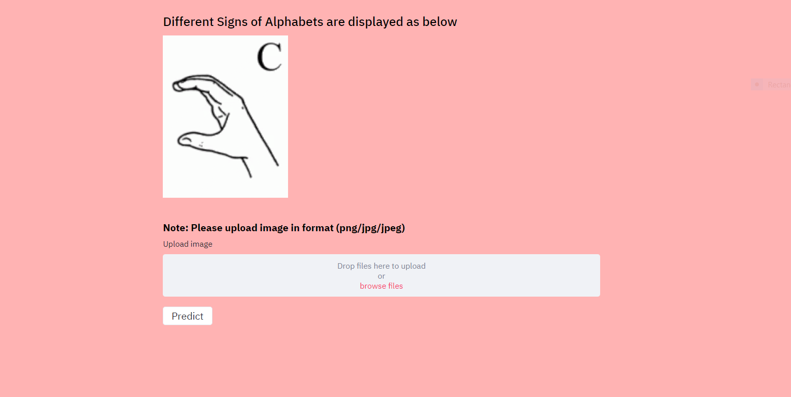

## ASL Prediction web application
American Sign Language (ASL) is the primary language used by many deaf individuals in North America, and it is also used by hard-of-hearing and hearing individuals. The language is as rich as spoken languages and employs signs made with the hand, along with facial gestures and bodily postures.

The Tech stack used here 
* Streamlit for webapp
* CNN
  
  ### Simple web application which able to detect the signs

 

 ### Sample screenshots

### Initial 

 

### After Uploading and Prediction

