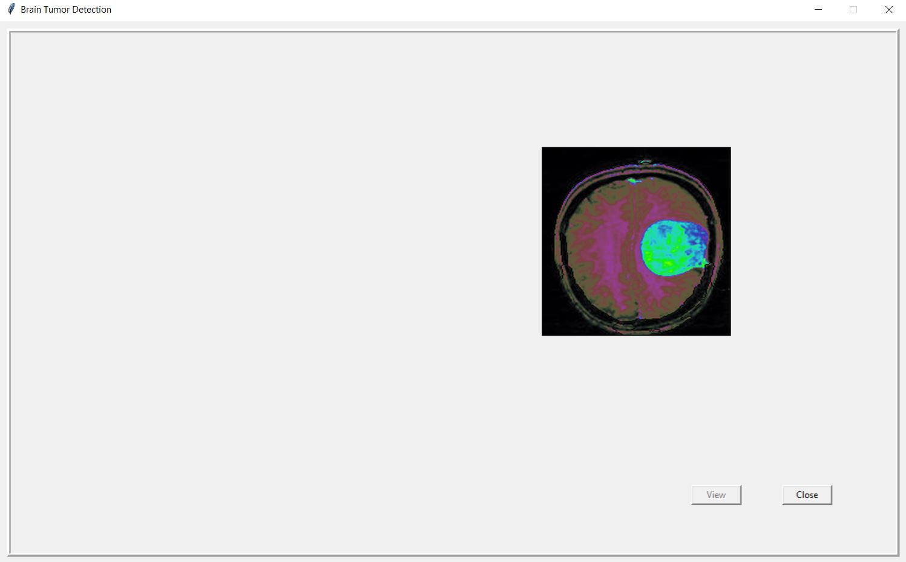

# Brain Tumor Detection

A brain tumor is an abnormal growth of tissue in the brain or central spine that can disrupt proper brain function. It is the abnormal growth of tissues in brain. If the tumor originates in the brain, it is called a primary brain tumor. Primary brain tumors can be benign or malignant. Benign brain tumors are not cancerous.

## Requirements

opencv

tensorflow

## Tumor Detection
The GUI can be used to detect and view the tumor region.

The tensorflow model can be used to detect if the MRI image contains tumor or not.

The tumor region can be viewed using Image processing methods applied through opencv. Image segmentation using marker-based watershed segmentation algorithm is used to view the tumor region. A watershed is a transformation defined on a grayscale image. We label the region which we are sure of being the foreground or object with one color(or intensity), and label the region which we are sure of being background or non-object with another color and finally the region which we are not sure of anything, we label it with 0. That is our marker. Then apply watershed algorithm. Then our marker will be updated with the labels we gave, and the boundaries of objects will have a value of -1.

