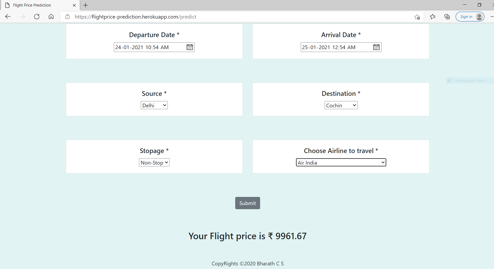

## Flight Price Prediction web app 

> This is an webapplication built using flask and deployed on heroku platform. This projects aims to predict the fare of the flight based on sevaeral parameters like source destination, source time ,destination ,dest time, number of stips in between and name of the airbus. Collecting these parameters the model which is built using ensemble algorithm(sckitlearn) will predict the fare.

## Techstack used
* Python
* Sckitlearn
* flask
* Machinelearning
  

  ## Some of the snapshots of the website

  

  ## Prediction

  

### You can use the web app by clicking [here](https://flightprice-prediction.herokuapp.com/)