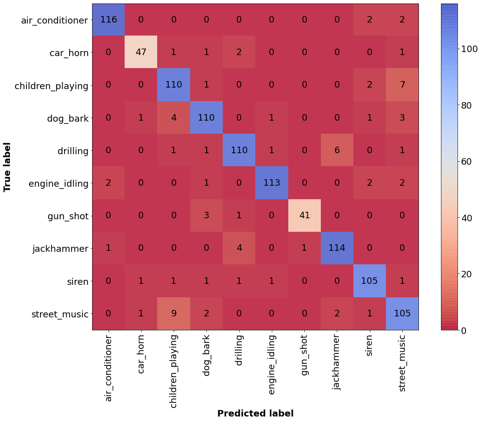

<h1 align="center"><b>Cat vs. Dog classification</b></h1>

  
 
The goal of this project is to classify the sound into one of the 10 categories.

* Classified into the following categories:
  1) air_conditioner
  2) car_horn
  3) children_playing
  4) dog_bark
  5) drilling
  6) engine_idling
  7) gun_shot
  8) jackhammer
  9) siren
  10) street_music
 
  
Dataset Link - https://zenodo.org/record/1203745

Trained model included
